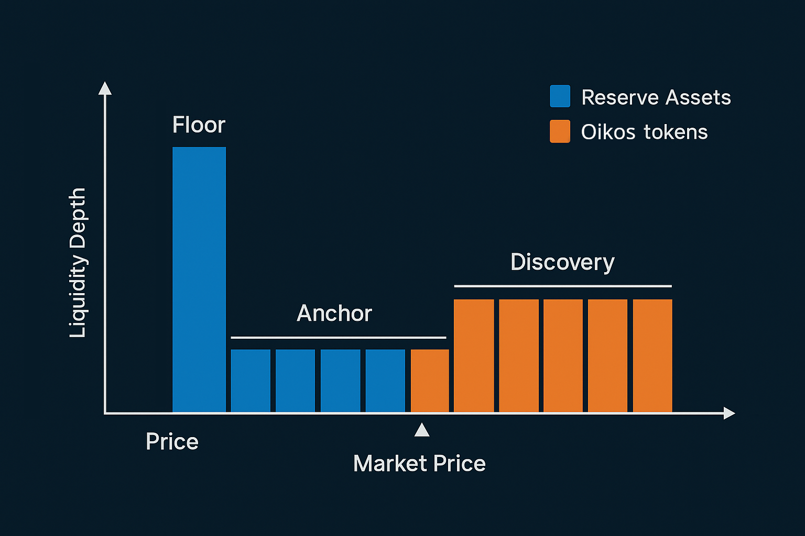

# Dynamic Liquidity & Supply

The Oikos protocol works as a market making middleware for the liquidity it controls. At the core of the system is a combination of Uniswap V3 concentrated positions and an algorithmic structure that allows the protocol to rebalance the liquidity in response to market conditions and guarantee that the insolvency invariant is always satisfied. 

## Protocol-Owned Liquidity structure

## Backed and unbacked supply
When a token is created, the initial supply is not backed by any reserve asset. Reserve assets can be funneled into the protocol in two ways: 

* *Trustless presale mechanism* - The protocol allows founders to run a presale for their token to raise funds for the initial liquidity. See <a href="#">Presale</a> section.

* *Trading activity* - As trading happens the positions are filled with the reserve asset. 

In both cases, presale purchases or trading activity are responsible for filling the liquidity positions with reserve assets. This mechanism consolidate the funds that back the initial supply deployed to the floor liquidity. Once the anchor price range is exhausted, trading moves to the the discovery position. At this point, the protocol starts accumulating surplus reserve assets that can be rebalanced toward the floor liquidity, increasing the floor price (IMV). This is because the algorithmic structure of the liquidity allows the protocol to always sell tokens at a markup, compared to the IMV itself. Once a certain threshold is crossed, the rebalance operation can be triggered permissionlessly by anyone. The threshold parameter is configurable "per-token" and can be adjusted at the request of project founders.

## Permissionless market making
During periods of positive price action, the rebalance operation is called "shift" and, as the name says, works by shifting upwards the entire liquidity structure, causing the floor price to increase; The supply of the token can increase during shift operations. This happens because unbacked tokens are minted to fill the discovery position and support positive price development. On the other hand, during periods of market downturn, the protocol can "slide" the liquidity positions in order to respond to market conditions. The slide operation effectively consolidates liquidity toward the market price, thinning discovery liquidity. 

## Dynamic supply
In order to facilitate integration with existing systems, founders define a maximum fixed supply for their token, which acts as a ceiling to mint operations for the protocol itself. However, in high demand scenarios, market making operations can mint unbacked tokens to fill the discovery position. This is done in order to support the price action and allow the protocol to capture more reserve assets. The opposite is true for negative price action, during which the protocol can burn unbacked tokens and reduce the supply. The parameters that govern the minting and burning of unbacked tokens are configurable "per-token" and can be adjusted at the request of project founders.