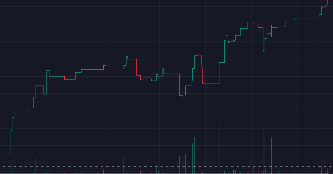

# Intrinsic Minimum Value (IMV)

The Intrinsic Minimum Value (IMV) is one of the most prominent features of the Oikos protocol. Every tokens launches with an initial floor price, which is designed to increase as the revenues generated by the protocol are reinvested into the liquidity. The IMV is a striking difference wth the traditional model of token distribution, where the price is often determined by speculation and market forces. The IMV is a guarantee that the token will always have a minimum value, which is backed by real liquidity. 

## Why this matters to holders

The IMV is a powerful tool for holders, as it provides them with a sense of security and confidence in the value of their assets. The IMV is designed to increase over time, which means that holders can expect to see their assets appreciate in value against the numéraire (reserve asset). The IMV provides a stable and predictable value for holders and helps to build trust and confidence in the project.

