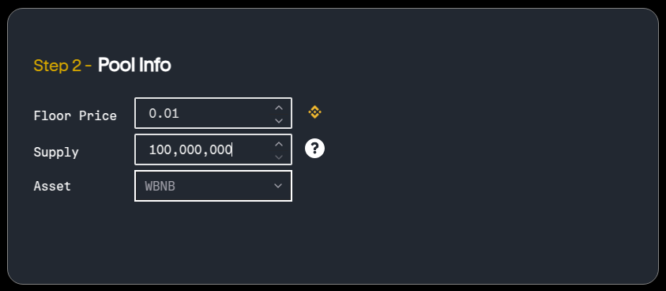

# Launchpad Overview

The launchpad allows project founders to coordinate the launch of their upcoming token in a fair and transparent way. The following rules are imposed at smart contract level:

* The contract enforces pre-determined bounds on parameters such as the presale price, soft/hard cap and duration of the presale.
* If the presale is not successful, the liquidity is returned to the liquidity pool and the presale is cancelled.
* Funds are sent directly to the designated liquidity pool on Uniswap V3, without human intervention.

Whether or not a presale is planned, the launchpad wizard guides the user through the process in three simple steps:

### 1 - **Token Information**

The user is asked to provide the token name, symbol, decimals and whether or not to include a presale. Defaults to "no presale".

### 2) **Pool Information**

The user enters the desired floor price, expressed in reserve asset (e.g. WBNB) and chooses the reserve asset itself. Initially only WBNB is available.

### 3(a) - **Confirm Deploy (no presale)**

If the user selected "no presale", step 3 will show a summary of the information provided in the previous steps and prompt the user to deploy the token.

Once the user accepts and confirms the transaction, the token is deployed and the corresponding entry is added to the markets section.

### 3(b) - **Presale Information**

If the user selected to include a presale, they will have to enter additional information such as the soft cap and presale duration. 

The presale price is computed automatically based on a fixed presale markup (25%). Lastly, the user specifies the desired soft cap (between 20% and 60% of the hard cap) and a duration for the presale (min 30 max 90 days). The presale can be finalized at any time before the end of the duration, as long as the soft cap is reached. 

* The presale markup can be changed on a per-project basis. Contact the team on Discord to discuss your project.

See the <a href="../launchpad/presale" target="_blank">Presale section</a> for details.

### 4 - **Confirm Deploy (with presale)**
This step will show a summary of the information provided in the previous steps (including the presale configuration) and prompt the user to deploy the token.

Once the user accepts and confirms the transaction, the token is deployed and a presale page is created and added to the corresponding section.

 
